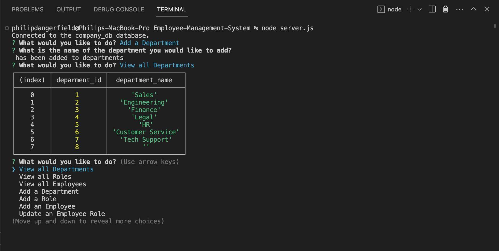

# Employee-Management-System

## Description

This command line application is meant to help a company manager their employees by using mysql2 and going through a simple menu to find what they need.

## Installation

In order to use this application you will need to have node installed on your machine and then first off installing the npms (inquirer, mysql2). From there this application is run within your terminal.

## Usage

Once you have the application running within your terminal you will be prompted to select options from a list, such as: View all Employees, Add a Department, Update an Employee. Depending on what you select you will be shown the proper info or asked questions that will then be entered into the companies database. ex. If you select Add a Department you will be asked what the name of the department is, after typing it in and hitting enter it will let you know that that department has been added to the department table.

## Credits

N/A

## License

MIT License

Copyright (c) [year] [fullname]

Permission is hereby granted, free of charge, to any person obtaining a copy
of this software and associated documentation files (the "Software"), to deal
in the Software without restriction, including without limitation the rights
to use, copy, modify, merge, publish, distribute, sublicense, and/or sell
copies of the Software, and to permit persons to whom the Software is
furnished to do so, subject to the following conditions:

The above copyright notice and this permission notice shall be included in all
copies or substantial portions of the Software.

THE SOFTWARE IS PROVIDED "AS IS", WITHOUT WARRANTY OF ANY KIND, EXPRESS OR
IMPLIED, INCLUDING BUT NOT LIMITED TO THE WARRANTIES OF MERCHANTABILITY,
FITNESS FOR A PARTICULAR PURPOSE AND NONINFRINGEMENT. IN NO EVENT SHALL THE
AUTHORS OR COPYRIGHT HOLDERS BE LIABLE FOR ANY CLAIM, DAMAGES OR OTHER
LIABILITY, WHETHER IN AN ACTION OF CONTRACT, TORT OR OTHERWISE, ARISING FROM,
OUT OF OR IN CONNECTION WITH THE SOFTWARE OR THE USE OR OTHER DEALINGS IN THE
SOFTWARE.